<div align="center">


# Mise en œuvre d’une infrastructure cloud de supervision centralisée sous AWS
## Déploiement de Zabbix conteneurisé (Docker) pour le monitoring d’un parc hybride (Linux & Windows)

**Étudiant :** Mohamed AASSOU 
**Encadrant :** Prof. Azeddine KHIAT  
**Filière :** 2ANCI - Génie Informatique
**Année universitaire :** 2025/2026


</div>

---

## Sommaire
1. [Page de garde](#1-page-de-garde)
2. [Introduction](#2-introduction)
3. [Architecture Réseau](#3-architecture-réseau)
4. [Instances EC2](#4-instances-ec2)
5. [Déploiement du serveur Zabbix](#5-déploiement-du-serveur-zabbix)
6. [Configuration des agents (Linux + Windows)](#6-configuration-des-agents-linux--windows)
7. [Monitoring et Tableaux de Bord](#7-monitoring-et-tableaux-de-bord)
8. [Difficultés rencontrées et solutions](#8-difficultés-rencontrées-et-solutions)
9. [Conclusion](#9-conclusion)
10. [Lien GitHub](#10-lien-github)

---

## 1. Page de garde

Cette section correspond à la page de garde exigée pour le livrable. Elle reprend les informations administratives et une image synthétique du projet.

- **Titre du projet :** Mise en œuvre d’une infrastructure cloud de supervision centralisée sous AWS
- **Sous-titre :** Zabbix conteneurisé (Docker) — Monitoring hybride Linux & Windows
- **Logo établissement :** voir le logo ci-dessus
- **Nom étudiant :** Mohamed AASSOU 
- **Encadrant :** Prof. Azeddine KHIAT
- **Filière :** 2ANCI - Génie Informatique
- **Année universitaire :** 2025/2026
- **Image du projet :** [images/architecture.png](images/architecture.png)

---

## 2. Introduction

### 2.1 Contexte
Dans un environnement informatique hybride (serveurs Linux et Windows), la supervision centralisée est un besoin critique pour détecter les pannes, anticiper les saturations de ressources et maintenir la disponibilité des services. Le cloud AWS permet de déployer rapidement une plateforme de monitoring standardisée, accessible et reproductible.

### 2.2 Objectifs techniques
L’objectif principal du projet est de **déployer une infrastructure de monitoring centralisée sur AWS** en utilisant **Zabbix conteneurisé (Docker)** afin de superviser :

- un **client Linux (Ubuntu)** équipé d’un agent Zabbix,
- un **client Windows Server** équipé d’un agent Zabbix,
- via un **serveur Zabbix** central (Zabbix Server + Web UI + base de données).

Les objectifs opérationnels incluent :

- la mise en place d’une architecture réseau conforme aux contraintes du lab (VPC + subnet public),
- la définition de règles de sécurité (Security Groups) respectant le principe du moindre privilège,
- la validation fonctionnelle via l’interface Zabbix (statut des hôtes, dernières données, graphiques).

### 2.3 Technologies utilisées

| Domaine | Technologie | Rôle |
|---|---|---|
| Cloud | AWS (Learner Lab) | Hébergement de l’infrastructure |
| Compute | EC2 t3.medium / t3.large | Instances Linux/Windows + serveur Zabbix |
| Réseau | VPC, Subnet, IGW, Route Table | Connectivité Internet et segmentation |
| Sécurité | Security Groups | Contrôle des ports autorisés |
| Conteneurisation | Docker + Docker Compose | Déploiement reproductible de Zabbix |
| Supervision | Zabbix 7.x (images officielles) | Collecte de métriques et tableaux de bord |
| OS | Ubuntu 22.04 / Windows Server | Systèmes des instances supervisées |

---

## 3. Architecture Réseau

### 3.1 Description du VPC
L’architecture proposée respecte les limitations du Learner Lab : **un seul VPC** et **un subnet public** afin de simplifier l’accès (sans VPN). Les ressources sont déployées dans la région **us-east-1 (N. Virginia)**, recommandée pour la stabilité des labs.

Paramètres réseau retenus :

- **VPC CIDR :** `10.0.0.0/16`
- **Subnet public CIDR :** `10.0.1.0/24`
- **Internet Gateway (IGW) :** attachée au VPC
- **Route Table :** route `0.0.0.0/0` vers l’IGW associée au subnet public

### 3.2 Schéma réseau

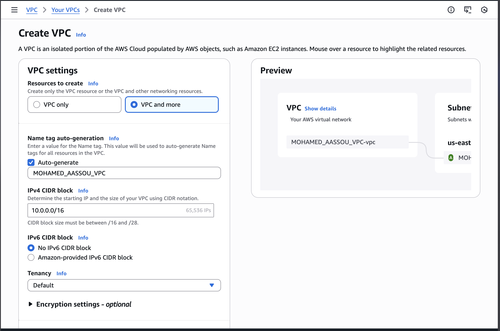

*Figure 1 : Création du VPC (CIDR 10.0.0.0/16).*

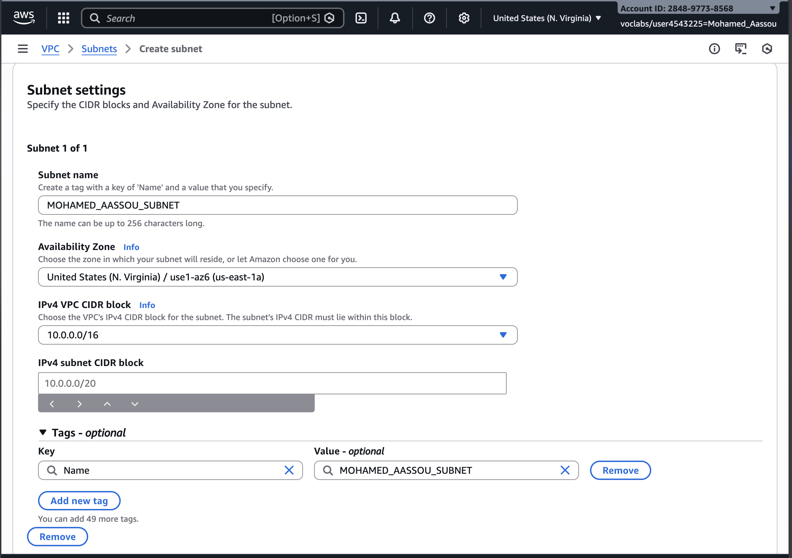

*Figure 2 : Création du subnet public (10.0.1.0/24).*

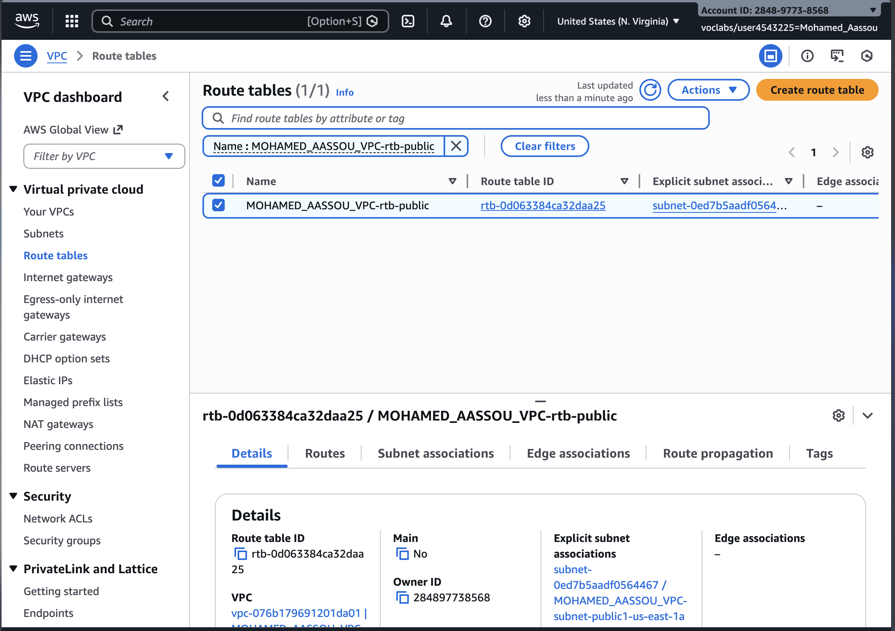

*Figure 3 : Configuration de la route `0.0.0.0/0` vers l’Internet Gateway (subnet public).*

### 3.3 Security Groups (ports autorisés)
Les groupes de sécurité autorisent les ports suivants (en inbound) :

- **80 / 443** : accès à l’interface Web Zabbix
- **10050** : agent Zabbix (sur les clients)
- **10051** : serveur Zabbix (écoute côté serveur)
- **22** : administration SSH (Linux)
- **3389** : administration RDP (Windows)

Tableau synthèse (recommandation de bonnes pratiques) :

| Cible | Port | Source recommandée | Justification |
|---|---:|---|---|
| Zabbix Server | 80/443 | `My IP` | Accès Web UI |
| Zabbix Server | 10051 | Subnet/VPC (ou SG clients) | Flux Zabbix (server) |
| Client Linux | 10050 | SG du Zabbix Server | Collecte agent par le serveur |
| Client Windows | 10050 | SG du Zabbix Server | Collecte agent par le serveur |
| Client Linux | 22 | `My IP` | Administration SSH |
| Client Windows | 3389 | `My IP` | Administration RDP |

Captures associées :

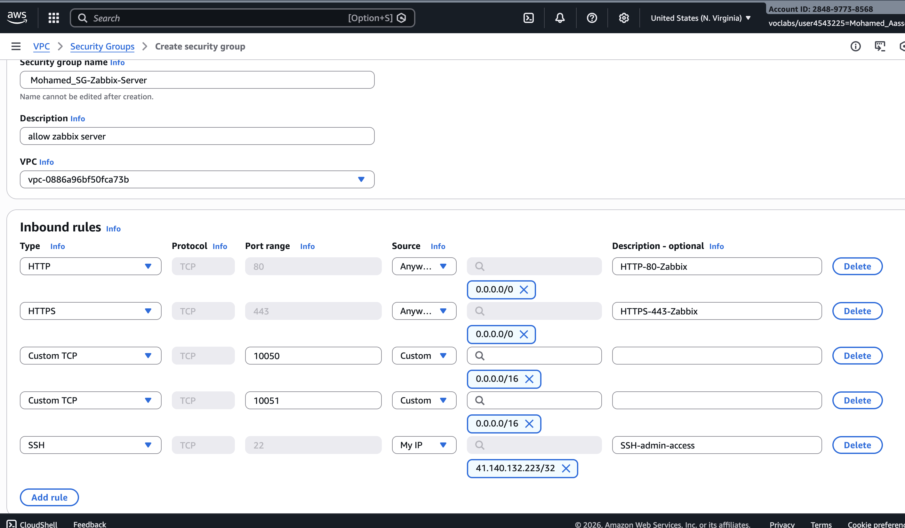

*Figure 4 : Règles inbound du SG du serveur Zabbix (Web + 10051 + SSH depuis My IP).*

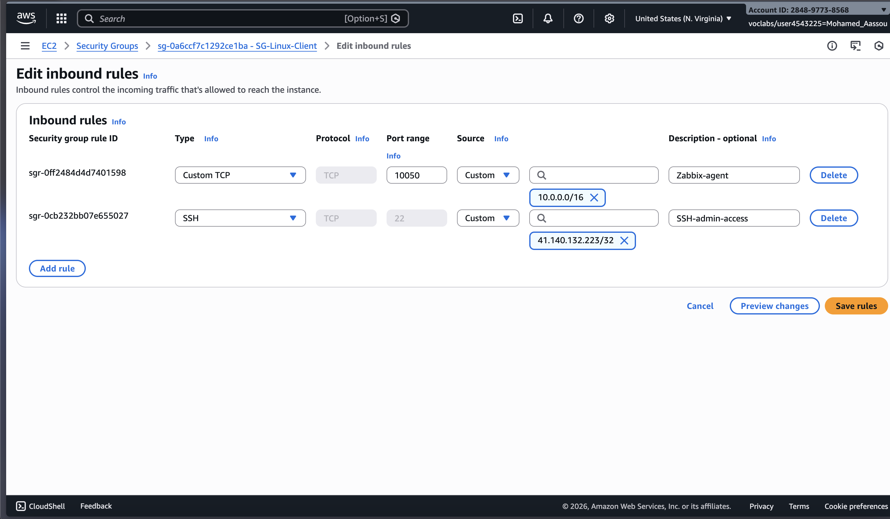

*Figure 5 : SG du client Linux (SSH depuis My IP + 10050 depuis le serveur Zabbix).*


*Figure 6 : SG du client Windows (RDP depuis My IP + 10050 depuis le serveur Zabbix).*

> Bonne pratique : pour réduire la surface d’attaque, limiter les sources à **My IP** pour l’administration (SSH/RDP/Web) et restreindre 10050/10051 aux flux internes (VPC ou SG-to-SG).

---

## 4. Instances EC2

### 4.1 Liste des instances et caractéristiques
Le projet comporte exactement **3 instances EC2** :

| Rôle | Type EC2 | OS | Justification principale |
|---|---|---|---|
| Serveur Zabbix (Docker) | `t3.large` | Ubuntu 22.04 | Confort CPU/RAM pour conteneurs + DB |
| Client Linux | `t3.medium` | Ubuntu 22.04 | Suffisant pour agent + charge modérée |
| Client Windows | `t3.large` | Windows Server | Windows Server nécessite plus de RAM pour être fluide |

Captures de lancement (création des instances) :

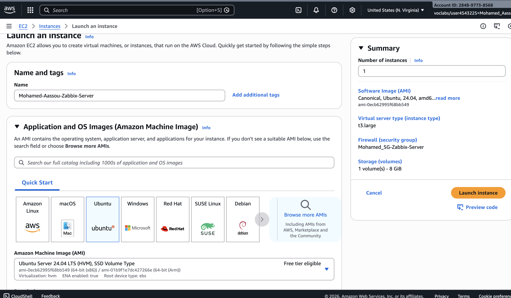

*Figure 7 : Lancement de l’instance serveur Zabbix (Ubuntu, t3.large).*

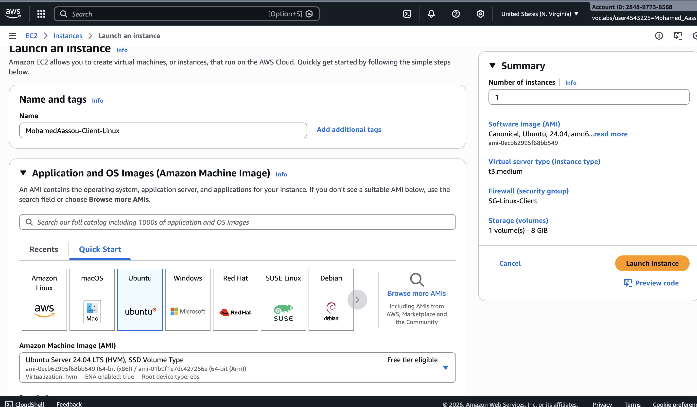

*Figure 8 : Lancement de l’instance client Linux (Ubuntu, t3.medium).*

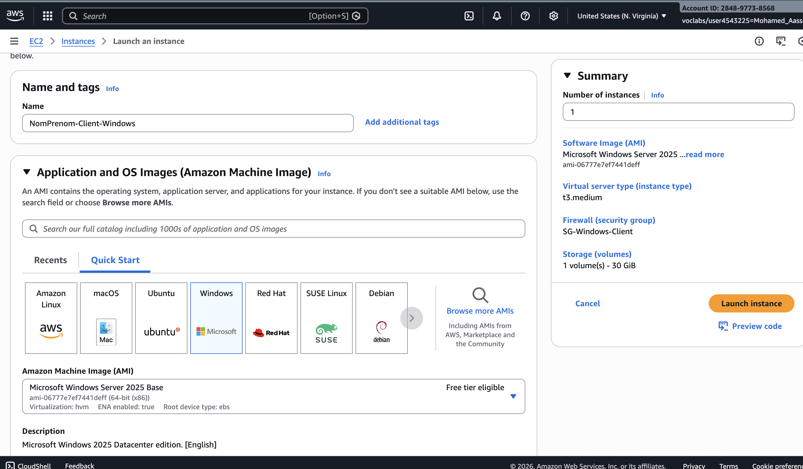

*Figure 9 : Lancement de l’instance client Windows (Windows Server, t3.large).*

Vue globale après lancement (instances en état « Running ») :


*Figure 10 : Instances EC2 du projet (serveur Zabbix + clients Linux/Windows).* 

### 4.2 Bonnes pratiques de déploiement EC2

- **Tags** : appliquer un tag explicite (ex: `MohamedAASSOU-Zabbix-Server`) pour faciliter l’inventaire.
- **Clé SSH** : utiliser une paire de clés dédiée au projet, permissions de fichier correctes (`chmod 400`).
- **Accès public** : uniquement via le subnet public (lab), puis restreindre via SG (My IP).

---

## 5. Déploiement du serveur Zabbix

### 5.1 Installation de Docker (Ubuntu)
Sur l’instance Ubuntu (serveur Zabbix), installer Docker en respectant une procédure standard :

```bash
sudo apt update
sudo apt install -y ca-certificates curl gnupg

sudo install -m 0755 -d /etc/apt/keyrings
curl -fsSL https://download.docker.com/linux/ubuntu/gpg | sudo gpg --dearmor -o /etc/apt/keyrings/docker.gpg
sudo chmod a+r /etc/apt/keyrings/docker.gpg

echo "deb [arch=$(dpkg --print-architecture) signed-by=/etc/apt/keyrings/docker.gpg] https://download.docker.com/linux/ubuntu $(. /etc/os-release && echo $VERSION_CODENAME) stable" \
| sudo tee /etc/apt/sources.list.d/docker.list > /dev/null

sudo apt update
sudo apt install -y docker-ce docker-ce-cli containerd.io docker-buildx-plugin docker-compose-plugin
sudo systemctl enable --now docker
```

Vérification :

```bash
docker --version
docker compose version
```

### 5.2 Installation de Docker Compose
Dans ce projet, Docker Compose est utilisé via le plugin officiel (`docker compose`). Cela permet :

- une configuration versionnée,
- un déploiement reproductible,
- un redémarrage simplifié en cas d’arrêt automatique du lab.

### 5.3 Fichier `docker-compose.yml` (détaillé)
Le fichier [docker-compose.yml](docker-compose.yml) déploie 3 services :

- **PostgreSQL** : base de données Zabbix
- **Zabbix Server** : moteur de supervision (port 10051)
- **Zabbix Web (Nginx)** : interface Web (port 80 publié)

Extrait complet utilisé dans le projet :

```yaml
services:
	postgres:
		image: postgres:16-alpine
		container_name: zabbix-postgres
		environment:
			POSTGRES_DB: zabbix
			POSTGRES_USER: zabbix
			POSTGRES_PASSWORD: zabbixpass
		volumes:
			- pgdata:/var/lib/postgresql/data
		restart: unless-stopped

	zabbix-server:
		image: zabbix/zabbix-server-pgsql:alpine-7.0-latest
		container_name: zabbix-server
		depends_on:
			- postgres
		environment:
			DB_SERVER_HOST: postgres
			POSTGRES_DB: zabbix
			POSTGRES_USER: zabbix
			POSTGRES_PASSWORD: zabbixpass
		ports:
			- "10051:10051"
		restart: unless-stopped

	zabbix-web:
		image: zabbix/zabbix-web-nginx-pgsql:alpine-7.0-latest
		container_name: zabbix-web
		depends_on:
			- postgres
			- zabbix-server
		environment:
			DB_SERVER_HOST: postgres
			POSTGRES_DB: zabbix
			POSTGRES_USER: zabbix
			POSTGRES_PASSWORD: zabbixpass
			ZBX_SERVER_HOST: zabbix-server
			PHP_TZ: Africa/Casablanca
		ports:
			- "80:8080"
		restart: unless-stopped

volumes:
	pgdata:
```

> Bonne pratique : en production, ne pas versionner les mots de passe en clair (utiliser AWS SSM Parameter Store / Secrets Manager). Dans le cadre du lab, ce choix vise la simplicité.

### 5.4 Démarrage des conteneurs

```bash
cd /path/to/project
docker compose up -d
docker compose ps
```

### 5.5 Vérification de l’interface Web
Depuis un navigateur, accéder à :

- `http://<Public-IP-Zabbix-Server>/`


*Figure 11 : Accès à l’interface Web Zabbix (service zabbix-web opérationnel).*

---

## 6. Configuration des agents (Linux + Windows)

### 6.1 Agent Zabbix sur Linux (Ubuntu)

#### 6.1.1 Installation

```bash
sudo apt update
sudo apt install -y zabbix-agent2
sudo systemctl enable --now zabbix-agent2
sudo systemctl status zabbix-agent2 --no-pager
```

#### 6.1.2 Configuration (extrait `zabbix_agent2.conf`)
Le fichier de configuration se trouve généralement ici :

- `/etc/zabbix/zabbix_agent2.conf`

Extrait recommandé (adapter IP/DNS du serveur) :

```ini
# IP/DNS du serveur Zabbix autorisé à interroger l’agent
Server=10.0.1.<IP_PRIVEE_ZABBIX_SERVER>

# Pour l’agent actif (optionnel)
ServerActive=10.0.1.<IP_PRIVEE_ZABBIX_SERVER>

# Nom d’hôte (doit correspondre au Host créé dans l’UI Zabbix)
Hostname=linux-client
```

Après modification :

```bash
sudo systemctl restart zabbix-agent2
```

Capture (configuration/hostname) :


*Figure 12 : Extrait de configuration de l’agent Linux (Hostname et paramètres serveur).*

### 6.2 Agent Zabbix sur Windows Server

#### 6.2.1 Installation
Sur Windows Server, l’agent peut être installé via un **MSI** (Zabbix Agent 2) :

- télécharger l’installateur depuis le site Zabbix,
- lancer l’installation en précisant le **Server** (IP privée du serveur Zabbix) et le **Hostname**.


*Figure 13 : Installation/configuration de l’agent Zabbix sur Windows Server (MSI).*

#### 6.2.2 Paramètres essentiels
Points critiques pour que l’hôte soit « Vert (ZBX) » :

- **Hostname** : identique entre Windows et Zabbix UI
- **Server** : IP/DNS du serveur Zabbix autorisé
- **Port** : 10050 ouvert depuis le SG du serveur Zabbix

---

## 7. Monitoring et Tableaux de Bord

### 7.1 Ajout des hôtes dans Zabbix
Dans l’interface Zabbix :

1. Aller dans **Configuration → Hosts**
2. **Create host** pour `linux-client` et `windows-client`
3. Définir l’interface **Agent** (IP privée du client) et associer un template adapté (ex: `Linux by Zabbix agent` / `Windows by Zabbix agent`).


*Figure 14 : Création d’un hôte dans Zabbix (définition Hostname, interface Agent et template).*

### 7.2 Vérification du statut « ZBX » en vert
Une fois les agents correctement configurés et les ports ouverts, Zabbix affiche un statut **ZBX** en vert indiquant que l’agent est joignable.

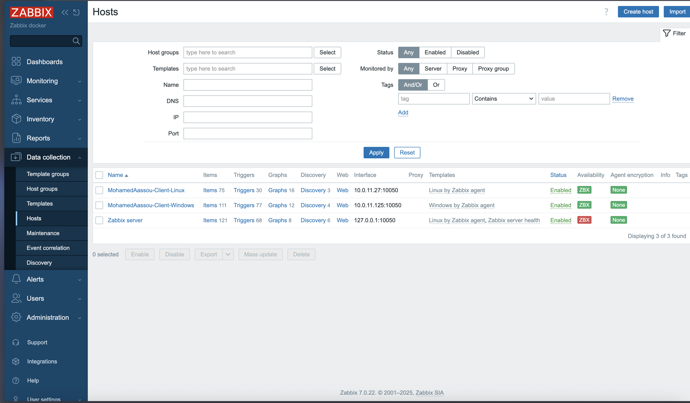

*Figure 15 : Validation de la connectivité des deux agents (statut ZBX en vert).*

### 7.3 Graphiques CPU/RAM et Latest Data
Les tableaux de bord et les graphiques permettent de suivre l’évolution des ressources dans le temps. L’exploitation attendue inclut un exemple de graphique CPU/RAM.

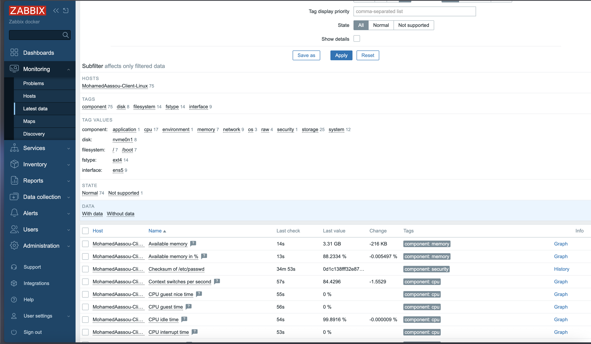

*Figure 16 : Exemple de données de supervision et vues Monitoring.*

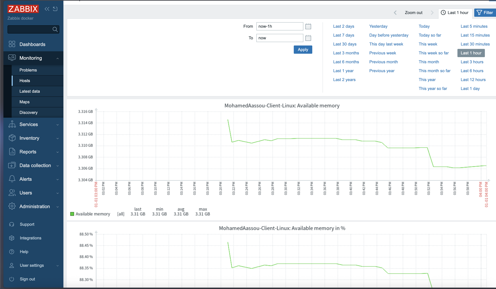

*Figure 17 : Exemple de graphique de charge CPU/RAM d’un client (preuve de collecte effective).*

---

## 8. Difficultés rencontrées et solutions

### 8.1 Ports bloqués / mauvaise source dans le SG
**Symptôme :** hôte en statut rouge (agent injoignable), absence de données.

**Causes typiques :**

- port **10050** non autorisé vers le client,
- port **10051** non autorisé vers le serveur,
- source trop large ou mal définie (ex: `0.0.0.0/0` au lieu de SG-to-SG / My IP).

**Solution :**

- vérifier les règles inbound/outbound,
- privilégier **SG du serveur Zabbix comme source** pour 10050 sur les clients,
- conserver **My IP** pour SSH/RDP/Web.

### 8.2 Docker non démarré après arrêt automatique du lab
**Contexte Learner Lab :** les instances peuvent être stoppées automatiquement (ou stoppées manuellement pour économiser le budget).

**Symptôme :** l’UI Zabbix ne répond plus après redémarrage de l’instance.

**Solution :**

```bash
cd /path/to/project
docker compose up -d
docker compose ps
```

### 8.3 Limitations critiques du Learner Lab

- **Région recommandée :** `us-east-1 (N. Virginia)`
- **Types d’instances :** rester sur `t3.medium` / `t3.large` (au-delà souvent bloqué)
- **Budget :** surveiller la consommation (environ 50$), **Stop** les instances hors sessions

---

## 9. Conclusion

Ce projet a permis de mettre en œuvre une infrastructure complète de supervision centralisée sur AWS, en respectant des contraintes réalistes (Learner Lab) et en démontrant la supervision d’un parc hybride Linux/Windows.

Acquis principaux :

- conception d’une architecture réseau AWS simple et fonctionnelle (VPC, subnet public, IGW, route table),
- configuration sécurisée via Security Groups et limitation des accès administratifs à **My IP**,
- déploiement reproductible de Zabbix via Docker Compose,
- intégration d’agents Linux et Windows et validation via statuts/graphes.

Améliorations futures possibles (hors périmètre lab) :

- subnet privé + NAT Gateway, accès via VPN/bastion,
- haute disponibilité (DB managée, sauvegardes),
- gestion des secrets (SSM/Secrets Manager),
- alerting avancé (mail, Teams, Slack) et reporting.

---

## 10. Lien GitHub

**Lien du dépôt :** _https://github.com/mohammedaassou/zabbix-docker-aws-monitoring.git_

Le dépôt doit contenir au minimum :

- ce **README** (rapport détaillé),
- [docker-compose.yml](docker-compose.yml),
- scripts/ressources utiles (ex: [tools/render_architecture_to_png.py](tools/render_architecture_to_png.py)),
- le dossier [images/](images/) avec les captures numérotées et les schémas.

