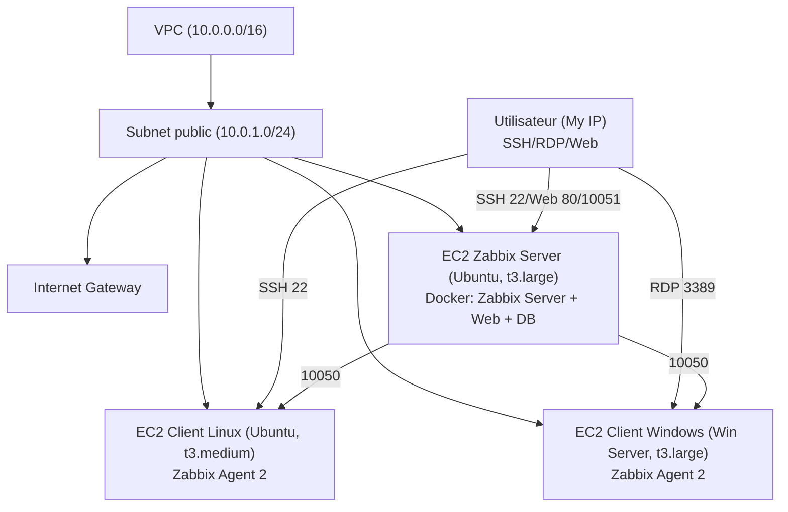

## Schéma d’architecture — Supervision centralisée AWS (Zabbix Docker)



**Légende :**
- **VPC** : réseau privé AWS
- **Subnet public** : accès Internet via IGW
- **EC2 Zabbix Server** : Ubuntu, Docker, Zabbix Server/Web/DB
- **EC2 Client Linux** : Ubuntu, Zabbix Agent 2
- **EC2 Client Windows** : Windows Server, Zabbix Agent 2
- **User** : accès sécurisé (My IP) via SSH/RDP/Web
- **Ports ouverts** : 22 (SSH), 80 (HTTP), 3389 (RDP), 10050/10051 (Zabbix)

---

Pour une version graphique, tu peux t’inspirer de ce schéma et le dessiner dans draw.io ou un autre outil, puis l’ajouter dans le dossier `images/` et l’inclure dans le README :

```markdown

```